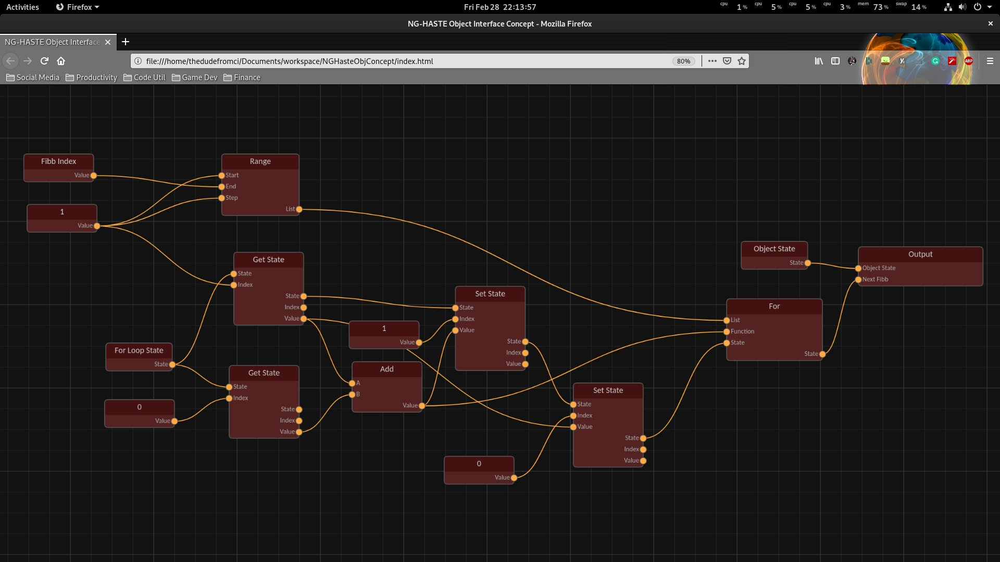

<h1 align="center">NodeLib</h1>

<i>NodeLib is a HTML5 library for rendering an interactive and configurable node graph application within a webpage. It is designed to be responsive and lightweight, and requires no external dependencies.</i>

  
  
  
  

---

### What is it used for?

The main purpose of these library is for display purposes for node graphs, such as configurable programs, often seen in CGI shaders or material generation, or simpler applications, such as mind mapping or other tree objects.

### Screenshots

### Getting Started

Simply download and drop the javascript and css files into your HTML header.
[See here](https://github.com/TheDudeFromCI/nodelib/blob/master/nodelib-compressed-test.html) for an example.
